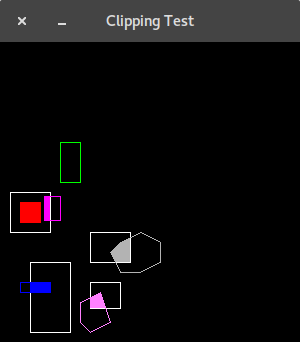
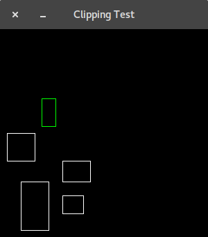
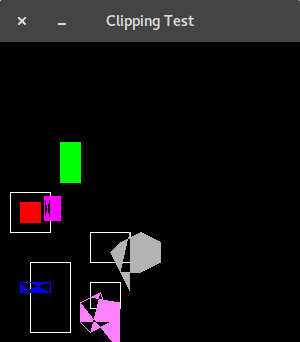

# PA 3 - Polygon Clipping

## Challenges
- Working with Java Arrays and ArrayLists was tough, especially
with ordering. I found the `java.awt.Point` class to be helpful to organize
the data into more manageable structures than just arrays. I tried using LinkedHashSets for a little bit, but
then realized there would be no duplicates anyway and the ordering was always maintained.
- I tried three different methods for determining if a point was inside vs. outside the clip edge.
    1. Outcodes, which proved to be overkill and only really effective for single line segment clipping.
    2. Many if and else statements to try and infer which edge was being clipped against just by the start and endpoints.
    3. Finally, used an enum and passed the specific edge along to the method, making everyone's life easier.
- Clipping the against the bottom was difficult, as the intersection calculation had a bug. Looking at the outputs, it 
was easy to see where I went wrong, but harder to find a solution.

## What I Found Helpful
- The slides gave a good overview of the cases for inside vs. outside, as well as the overall algorithm 
implementation. The only thing that was unclear about the implementation was the variable names / types.
- The slides, as well as other online geometry resources, helped shape a good intersection formula.
- Graphing the points on computer software and running through iterations by hand proved 
essential to understanding the methodology.

## Formal Documentation
Javadocs, along with comments, are found in the `docs` directory.

Ignore the package -- just for local development.

## Screenshots

Working:  

All points outside working:  

Here was my first attempt:  

